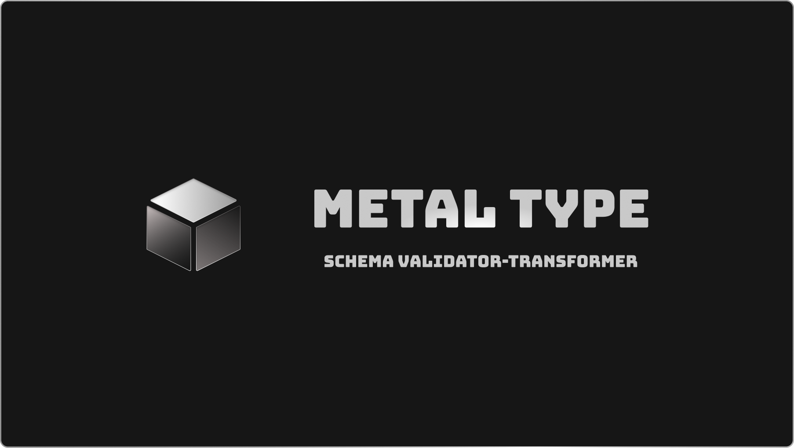

<br />

<div align="center">

</div>

<br />

## Write schema with confidence

1. Declarative api inspired by `zod`
2. First class type-safety
3. Handsome error trackings
4. Fast to use - upto 5x faster than `zod`
5. Small - 6.6kb

## In a nutshell

1. Define a schema

```ts
import { t } from "metal-type"

const People = t.object({
    name: t.string,
    age: t.number,
    isDeveloper: t.boolean,
    friends: t.array(t.string),
    address: t
        .object({
            street: t.string,
            city: t.string,
            zip: t.number,
        })
        .optional(),
})
```

2. Parse data

```ts
const data = {
    name: "John",
    age: 42,
    isDeveloper: true,
    friends: ["Jane", "Jack"],
    address: {
        street: "123 Main St",
        city: "New York",
        zip: "12345", // <- Error: Expected number, got string
    },
}
const parsed = People.parse(data)
```

3. Check errors

```
VALIDATION: [Err_1] object_value_error
› Expected:
{
    name: string,
    age: number,
    isDeveloper: boolean,
    friends: Array<string>,
    address: {
       street: string,
       city: string,
       zip: number
    } | undefined
}
› Received:
{
   "name": "John",
   "age": 42,
   "isDeveloper": true,
   "friends": [
      "Jane",
      "Jack"
   ],
   "address": {
      "street": "123 Main St",
      "city": "New York",
      "zip": "12345"
   }
}
› Check: [field "address"]

[Err_2] object_value_error
› Expected:
{
    street: string,
    city: string,
    zip: number
} | undefined
› Received:
{
   "street": "123 Main St",
   "city": "New York",
   "zip": "12345"
}
› Check: [field "zip"]

[Err_3] number_error
› Expected: number
› Received: 12345
› Check: 12345 is string
```

How easy is that?

4. Infer schema types

```ts
import { Infer } from "metal-type"
type People = Infer<typeof People>
/**
 * type People = {
 *     name: string;
 *     age: number;
 *     isDeveloper: boolean;
 *     friends: string[];
 *     address: {
 *         street: string;
 *         city: string;
 *         zip: number;
 *     } | undefined;
 * }
 */
```

## Installation

```bash
npm install metal-type
```

## Documentation

Will be available soon.

## Contributing

Check [CONTRIBUTING.md](./CONTRIBUTING.md) for more information.

## License

MIT
